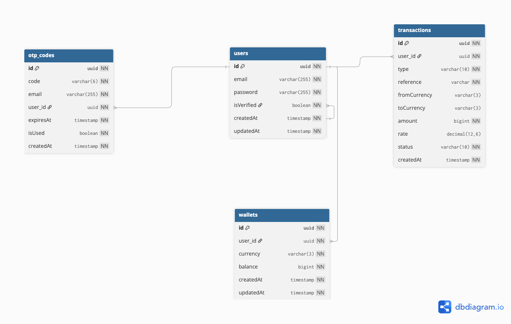

# FX Trading App - Backend API

A backend system for foreign exchange (FX) trading that enables users to register, verify their email, manage multi-currency wallets, and perform real-time currency conversions using live exchange rates.

##  Table of Contents

- [Features](#features)
- [Tech Stack](#tech-stack)
- [Prerequisites](#prerequisites)
- [Installation](#installation)
- [Configuration](#configuration)
- [Database Setup](#database-setup)
- [Running the Application](#running-the-application)
- [API Documentation](#api-documentation)
- [Key Assumptions](#key-assumptions)
- [Architectural Decisions](#architectural-decisions)
- [Security Considerations](#security-considerations)
- [Testing](#testing)
- [Future Enhancements](#future-enhancements)

---

##  Features

- **User Authentication**
  - Email based registration with OTP verification
  - JWT-based authentication
  - Protected endpoints - login required

- **Multi-Currency Wallet System**
  - Support for multiple currencies (NGN, USD, EUR, GBP)
  - Automatic wallet creation per currency
  - Real-time balance tracking

- **FX Trading & Conversion**
  - Real-time exchange rates from external API
  - Convert between any supported currency pairs
  - Bidirectional trading (NGN ↔ Other currencies)

- **Transaction Management**
  - Comprehensive transaction history
  - Support for FUND, CONVERT, and TRADE operations
  - Atomic transaction processing
  - Idempotency support via unique references

---

##  Project Schema



##  Tech Stack

- **Backend Framework:** NestJS (Node.js)
- **ORM:** TypeORM
- **Database:** PostgreSQL
- **Authentication:** JWT (Passport)
- **Email Service:** Nodemailer (Gmail SMTP)
- **FX API:** ExchangeRate-API
- **Validation:** class-validator & class-transformer
- **Language:** TypeScript

---

## 📦 Prerequisites

Before you begin, ensure you have the following installed:

- **Node.js** (v18.x or higher) - [Download](https://nodejs.org/)
- **npm** (v9.x or higher) - comes with Node.js
- **PostgreSQL** (v14.x or higher) - [Download](https://www.postgresql.org/download/)
- **Git** - [Download](https://git-scm.com/)

---

## 🚀 Installation

### 1. Clone the Repository

```bash
git clone https://github.com/yourusername/fx-trading-app.git
cd fx-trading-app
```

### 2. Install Dependencies

```bash
npm install
```

---

## ⚙️ Configuration

### 1. Create Environment File

Create a `.env` file in the root directory:

```bash
cp .env.example .env
```

### 2. Configure Environment Variables

Edit the `.env` file with your configuration:

```env
# Application
NODE_ENV=development
PORT=3000

# Database Configuration
DB_HOST=localhost
DB_PORT=5432
DB_USERNAME=postgres
DB_PASSWORD=your_postgres_password
DB_DATABASE=fx_trading_db

# JWT Configuration
JWT_SECRET=your_super_secret_jwt_key_here
JWT_EXPIRATION=24h

# Email Configuration (Gmail SMTP)
EMAIL_HOST=smtp.gmail.com
EMAIL_PORT=587
EMAIL_USER=your-email@gmail.com
EMAIL_PASSWORD=your-app-specific-password
EMAIL_FROM=FX Trading App <noreply@fxtrading.com>

# FX API Configuration
FX_API_KEY=your_exchangerate_api_key
FX_API_URL=https://v6.exchangerate-api.com/v6

# OTP Configuration
OTP_EXPIRY_MINUTES=10
```

### 3. Get API Keys

#### **ExchangeRate-API Key:**
1. Visit [https://www.exchangerate-api.com](https://www.exchangerate-api.com)
2. Sign up for a free account
3. Copy your API key
4. Add it to `FX_API_KEY` in `.env`

#### **Gmail App Password:**
1. Enable 2-Factor Authentication on your Google Account
2. Go to Google Account Settings → Security → App Passwords
3. Generate a new app password for "Mail"
4. Add it to `EMAIL_PASSWORD` in `.env`

---

## 💾 Database Setup

### 1. Create PostgreSQL Database

```bash
# Login to PostgreSQL
psql -U postgres

# Create database
CREATE DATABASE fx_trading_db;

# Exit PostgreSQL
\q
```

### 2. Run Migrations

TypeORM will automatically create tables on first run. If you want to run migrations manually:

```bash
npm run migration:run
```

### 3. Verify Database Connection

```bash
npm run start:dev
```

If successful, you should see:
```
[Nest] Database connected successfully
[Nest] Application is running on: http://localhost:3000
```

---

## 🏃 Running the Application

### Development Mode (with hot-reload)

```bash
npm run start:dev
```

### Production Mode

```bash
# Build the application
npm run build

# Start production server
npm run start:prod
```

### Debug Mode

```bash
npm run start:debug
```

The API will be available at: `http://localhost:3000`

---

## API Documentation

### Base URL
```
http://localhost:3000
```

### Authentication
Most endpoints require a JWT token in the Authorization header:
```
Authorization: Bearer <your_jwt_token>
```

---

### Authentication Endpoints

#### **Register User**
```http
POST /auth/register
Content-Type: application/json

{
  "email": "user@example.com",
  "password": "SecurePass123"
}
```

**Response:**
```json
{
  "success": true,
  "message": "Registration successful. Please check your email for OTP.",
  "data": {
    "userId": "uuid-here",
    "email": "user@example.com"
  }
}
```

---

#### **Verify OTP**
```http
POST /auth/verify
Content-Type: application/json

{
  "email": "user@example.com",
  "otp": "123456"
}
```

**Response:**
```json
{
  "success": true,
  "message": "Email verified successfully",
  "data": {
    "accessToken": "eyJhbGciOiJIUzI1NiIsInR5cCI6IkpXVCJ9..."
  }
}
```

---

#### **Login**
```http
POST /auth/login
Content-Type: application/json

{
  "email": "user@example.com",
  "password": "SecurePass123"
}
```

**Response:**
```json
{
  "success": true,
  "message": "Login successful",
  "data": {
    "accessToken": "eyJhbGciOiJIUzI1NiIsInR5cCI6IkpXVCJ9...",
    "user": {
      "id": "uuid",
      "email": "user@example.com"
    }
  }
}
```

---

### 💰 Wallet Endpoints

#### **Get User Wallets**
```http
GET /wallet
Authorization: Bearer <token>
```

**Response:**
```json
{
  "success": true,
  "data": [
    {
      "id": "wallet-uuid",
      "currency": "NGN",
      "balance": 50000,
      "createdAt": "2026-02-04T10:00:00.000Z"
    },
    {
      "id": "wallet-uuid-2",
      "currency": "USD",
      "balance": 100.50,
      "createdAt": "2026-02-04T11:00:00.000Z"
    }
  ]
}
```

---

#### **Get Wallet Balance**
```http
GET /wallet/:currency/balance
Authorization: Bearer <token>
```

**Example:**
```http
GET /wallet/NGN/balance
```

**Response:**
```json
{
  "success": true,
  "data": {
    "currency": "NGN",
    "balance": 50000
  },
  "message": "Wallet balance retrieved successfully"
}
```

---

#### **Fund Wallet**
```http
POST /wallet/fund
Authorization: Bearer <token>
Content-Type: application/json

{
  "currency": "NGN",
  "amount": 10000,
  "reference": "optional-unique-ref"
}
```

**Response:**
```json
{
  "success": true,
  "message": "Wallet funded successfully",
  "data": {
    "wallet": {
      "currency": "NGN",
      "balance": 60000
    },
    "transaction": {
      "id": "tx-uuid",
      "type": "FUND",
      "amount": 10000,
      "reference": "FUND-1738680000-abc123",
      "status": "SUCCESS"
    }
  }
}
```

---

### 💱 Currency Conversion Endpoints

#### **Convert Currency**
```http
POST /wallet/convert
Authorization: Bearer <token>
Content-Type: application/json

{
  "fromCurrency": "NGN",
  "toCurrency": "USD",
  "amount": 1000
}
```

**Response:**
```json
{
  "success": true,
  "message": "Currency converted successfully",
  "data": {
    "fromCurrency": "NGN",
    "toCurrency": "USD",
    "amountConverted": 1000,
    "amountReceived": 0.61,
    "rate": 0.000606,
    "sourceBalance": 49000,
    "destBalance": 100.61,
    "transaction": {
      "id": "tx-uuid",
      "type": "CONVERT",
      "reference": "CONVERT-1738680100-xyz789"
    }
  }
}
```

---

#### **Trade Currency** (Alias for Convert)
```http
POST /wallet/trade
Authorization: Bearer <token>
Content-Type: application/json

{
  "fromCurrency": "USD",
  "toCurrency": "EUR",
  "amount": 50
}
```

---

#### **Get Exchange Rates**
```http
GET /fx/rates/:currency
Authorization: Bearer <token>
```

**Example:**
```http
GET /fx/rates/NGN
```

**Response:**
```json
{
  "success": true,
  "data": {
    "USD": 0.000606,
    "EUR": 0.000558,
    "GBP": 0.000483,
    "JPY": 0.0932
  }
}
```

---

### 📊 Transaction Endpoints

#### **Get Transaction History**
```http
GET /transactions
Authorization: Bearer <token>
```

**Query Parameters:**
- `type` (optional): Filter by transaction type (FUND, CONVERT, TRADE)
- `currency` (optional): Filter by currency
- `limit` (optional): Number of results (default: 50)
- `offset` (optional): Pagination offset (default: 0)

**Example:**
```http
GET /transactions?type=CONVERT&limit=10
```

**Response:**
```json
{
  "success": true,
  "data": [
    {
      "id": "tx-uuid",
      "type": "CONVERT",
      "fromCurrency": "NGN",
      "toCurrency": "USD",
      "amount": 1000,
      "rate": 0.000606,
      "status": "SUCCESS",
      "reference": "CONVERT-1738680100-xyz789",
      "createdAt": "2026-02-04T12:30:00.000Z"
    }
  ],
  "total": 1
}
```

---

## 🔑 Key Assumptions

### **1. Initial Wallet Funding**
- Users can fund their wallets starting with any supported currency, not just NGN
- Initial wallet balance is 0 for all currencies
- Wallets are auto-created when a user first funds or receives a currency

### **2. FX Rates**
- Exchange rates are fetched from ExchangeRate-API in real-time
- Rates are cached for 5 minutes to optimize API usage and performance
- The rate used at the time of conversion is stored in the transaction record for audit purposes
- If the external API fails, the system returns an error (no fallback rates in this version)

### **3. OTP Verification**
- OTPs expire after 10 minutes (configurable via `OTP_EXPIRY_MINUTES`)
- Each OTP can only be used once
- Only verified users can access wallet and trading features
- OTP codes are 6 digits

### **4. Transaction References**
- References are auto-generated on the backend to prevent client-side manipulation
- Format: `{TYPE}-{timestamp}-{random}`
- Users can optionally provide their own reference for idempotency
- Duplicate references are rejected to prevent double-spending

### **5. Supported Currencies**
- Default supported currencies: NGN, USD, EUR, GBP
- Additional currencies can be easily added via the Currency enum
- All currencies use 2 decimal precision for balance display

### **6. Balance Storage**
- Balances are stored as `bigint` in the database to handle large amounts
- Frontend should handle display formatting and decimal places

### **7. Transaction Atomicity**
- All wallet operations (fund, convert, trade) use database transactions
- Either all updates succeed or all rollback (no partial states)
- Prevents race conditions and ensures data consistency

---

## 🏗 Architectural Decisions

### **1. Module Structure**

```
src/
├── auth/                 # Authentication & authorization
│   ├── strategies/       # Passport JWT strategy
│   ├── guards/          # Auth guards
│   └── dto/             # Login, register DTOs
├── users/               # User management
│   ├── entities/        # User entity
│   └── services/        # User CRUD operations
├── wallet/              # Wallet management
│   ├── entities/        # Wallet entity
│   └── services/        # Fund, balance operations
├── transaction/         # Transaction tracking
│   ├── entities/        # Transaction entity
│   └── services/        # Transaction history
├── fx/                  # FX rate integration
│   └── services/        # External API calls, caching
├── otp/                 # OTP verification
│   ├── entities/        # OTP entity
│   └── services/        # Generate, verify OTP
└── common/              # Shared utilities
    ├── responses/       # API response wrapper
    └── filters/         # Exception filters
```

**Rationale:** Modular architecture allows for:
- Clear separation of concerns
- Easy testing of individual modules
- Future scalability (can extract modules to microservices)
- Better code organization and maintainability

---

### **2. Multi-Currency Wallet Design**

**Chosen Approach:** One wallet record per user per currency

```
User 1 → NGN Wallet (balance: 50000)
      → USD Wallet (balance: 100.50)
      → EUR Wallet (balance: 75.00)
```

**Alternative Considered:** Single wallet with JSON column
```
User 1 → Wallet { balances: { NGN: 50000, USD: 100.50 } }
```

**Why We Chose Separate Records:**
- ✅ Better database indexing and query performance
- ✅ Easier to enforce constraints at DB level
- ✅ Simpler transaction logic (update single record)
- ✅ Natural relationship modeling
- ✅ Unique constraint on (user_id, currency) prevents duplicates

---

### **3. Transaction → User Relationship**

Transactions are mapped to **Users**, not individual wallets.

**Rationale:**
- User-centric transaction history (one query gets all transactions)
- Conversions involve two wallets but belong to one user
- Simpler queries and better performance
- Transaction integrity maintained even if wallets are modified

---

### **4. Database Transaction Usage**

All wallet-modifying operations wrapped in database transactions:

```typescript
await this.dataSource.transaction(async (manager) => {
  // Update wallet 1
  // Update wallet 2
  // Create transaction record
  // All succeed or all rollback
});
```

**Rationale:**
- Prevents partial updates (e.g., deduct from wallet but fail to add to another)
- ACID compliance ensures data integrity
- Handles concurrent requests safely

---

### **5. FX Rate Caching Strategy**

**In-Memory Cache** with 5-minute TTL

**Why Not Redis?**
- Simpler implementation for MVP
- Sufficient for moderate traffic
- Can upgrade to Redis later if needed

**Why Cache at All?**
- Reduces external API calls (free tier has limits)
- Faster response times
- Reduces dependency on external service availability

---

### **6. Password Security**

- **Bcrypt** with 10 salt rounds
- Passwords never stored in plain text
- Password field excluded from query results by default (`select: false`)

---

### **7. Error Handling**

**Consistent API Response Format:**
```typescript
{
  "success": boolean,
  "message": string,
  "data"?: any
}
```

**Benefits:**
- Predictable response structure for frontend
- Easy error handling on client side
- Clear success/failure indication

---

### **8. Validation Layer**

- **DTOs** with class-validator decorators
- Input validation happens before business logic
- Type safety with TypeScript
- Auto-generated validation errors

---

## 🔒 Security Considerations

### **1. Authentication & Authorization**
- JWT tokens with configurable expiration
- Passwords hashed with bcrypt (salt rounds: 10)
- Email verification required before trading
- Protected routes use JWT guard

### **2. Input Validation**
- All inputs validated using class-validator
- SQL injection prevention via TypeORM parameterized queries
- XSS protection through input sanitization

### **3. Transaction Security**
- Atomic database transactions prevent race conditions
- Idempotency via unique references prevents duplicate processing
- Balance checks inside transactions (after locks acquired)

### **4. Rate Limiting** (Recommended for Production)
```typescript
// Future implementation
@UseGuards(ThrottlerGuard)
@Throttle(10, 60) // 10 requests per 60 seconds
```

### **5. Environment Variables**
- Sensitive data stored in `.env` file
- `.env` excluded from version control
- Different configs for dev/staging/production

---

## 🧪 Testing

### Run All Tests
```bash
npm run test
```

### Run Tests in Watch Mode
```bash
npm run test:watch
```

### Run Test Coverage
```bash
npm run test:cov
```

### Run E2E Tests
```bash
npm run test:e2e
```

### Test Structure
```
test/
├── unit/
│   ├── wallet.service.spec.ts
│   ├── fx.service.spec.ts
│   └── transaction.service.spec.ts
└── e2e/
    ├── auth.e2e-spec.ts
    └── wallet.e2e-spec.ts
```

---

## 📈 Scalability Considerations

### **How This System Can Scale to Millions of Users**

#### **1. Database Optimization**
- **Indexing:** Composite indexes on (user_id, currency) for fast lookups
- **Connection Pooling:** Configure TypeORM pool size based on load
- **Read Replicas:** Separate read/write operations for transaction history queries
- **Partitioning:** Partition transactions table by date for faster queries

#### **2. Caching Layer**
- **Redis Integration:** Replace in-memory cache with Redis for distributed caching
- **Cache Patterns:**
  - FX rates (5-minute TTL)
  - User wallet balances (1-minute TTL)
  - Transaction history (cache frequent queries)

#### **3. Microservices Architecture**
```
Current Monolith → Future Microservices:
├── Auth Service (handles authentication)
├── Wallet Service (manages wallets & balances)
├── FX Service (rate fetching & caching)
├── Transaction Service (transaction history)
└── Notification Service (emails, SMS)
```

#### **4. Message Queues**
- **Bull/RabbitMQ** for async operations:
  - Email sending
  - Transaction processing
  - Report generation

#### **5. Load Balancing**
- Multiple application instances behind NGINX/AWS ALB
- Session-less design (JWT) allows horizontal scaling

#### **6. Database Sharding**
- Shard by user_id for wallet data
- Separate transaction database with time-series optimization

---

## 🚀 Future Enhancements

### **Planned Features**

1. **Role-Based Access Control (RBAC)**
   - Admin users can view all transactions
   - Regular users restricted to their own data
   - Audit logs for admin actions

2. **Advanced Caching**
   - Redis implementation for distributed caching
   - Cache invalidation strategies
   - Session management with Redis

3. **Analytics & Reporting**
   - Trading volume metrics
   - Popular currency pairs
   - User activity dashboards
   - Revenue tracking (if fees implemented)

4. **Transaction Verification**
   - Webhook support for payment gateways
   - Double-entry bookkeeping validation
   - Reconciliation reports

5. **Enhanced Security**
   - Two-factor authentication (2FA)
   - IP whitelisting
   - Device fingerprinting
   - Suspicious activity detection

6. **API Rate Limiting**
   - Per-user rate limits
   - Tiered limits based on account type
   - DDoS protection

7. **Notification System**
   - Email notifications for transactions
   - SMS alerts for large transfers
   - Push notifications via mobile app

8. **KYC Integration**
   - Document upload and verification
   - Tiered trading limits
   - Compliance with financial regulations

9. **Multi-Language Support**
   - i18n for API responses
   - Email templates in multiple languages

10. **Webhook Support**
    - Real-time notifications to external systems
    - Transaction status updates
    - Balance change alerts

---

## 📝 Development Guidelines

### **Code Style**
- Follow NestJS best practices
- Use TypeScript strict mode
- Consistent naming conventions (camelCase for variables, PascalCase for classes)
- Meaningful variable and function names

### **Git Workflow**
```bash
# Feature branch workflow
git checkout -b feature/wallet-conversion
# Make changes
git commit -m "feat: add wallet conversion endpoint"
git push origin feature/wallet-conversion
# Create pull request
```

### **Commit Message Convention**
```
feat: add new feature
fix: bug fix
docs: documentation updates
refactor: code refactoring
test: add tests
chore: maintenance tasks
```

---

## 🐛 Troubleshooting

### **Database Connection Failed**
```
Error: connect ECONNREFUSED 127.0.0.1:5432
```

**Solution:**
1. Ensure PostgreSQL is running: `pg_ctl status`
2. Check credentials in `.env`
3. Verify database exists: `psql -l`

---

### **Email Sending Failed**
```
Error: Invalid login: 535-5.7.8 Username and Password not accepted
```

**Solution:**
1. Enable 2FA on Google Account
2. Generate App Password (not regular password)
3. Update `EMAIL_PASSWORD` in `.env`

---

### **FX API Rate Limit**
```
Error: 429 Too Many Requests
```

**Solution:**
1. Free tier has 1,500 requests/month
2. Increase cache duration
3. Upgrade to paid plan
4. Implement request throttling

---

## 📞 Support & Contact

For questions or issues:
- **Email:** support@fxtrading.com
- **GitHub Issues:** [Create an issue](https://github.com/yourusername/fx-trading-app/issues)

---

## 📄 License

This project is licensed under the MIT License - see the [LICENSE](LICENSE) file for details.

---

## 👥 Contributors

- **Your Name** - Initial work - [GitHub](https://github.com/yourusername)

---

## 🙏 Acknowledgments

- NestJS framework and community
- ExchangeRate-API for FX data
- TypeORM for database management

---

**Built with ❤️ using NestJS**
